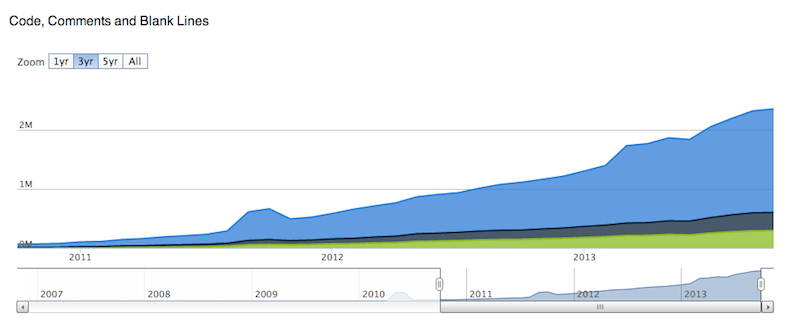
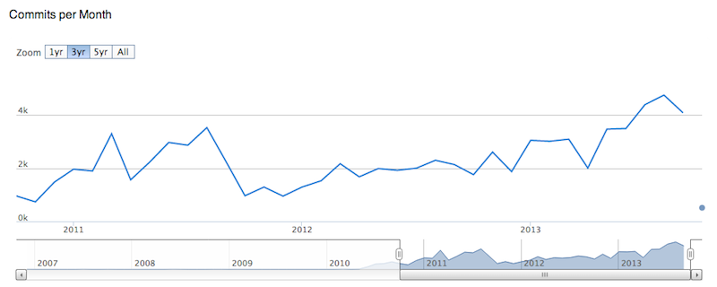
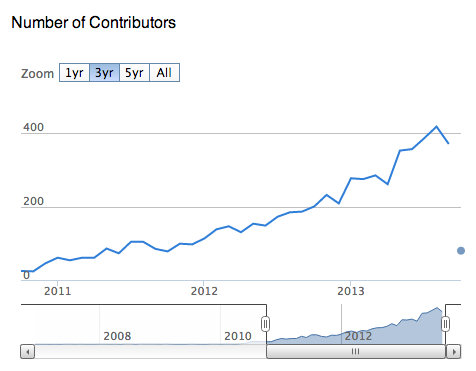

=======================================
 Static Code Analysis and Style Checks
=======================================

| Doug Hellmann
| PyATL
| 10 October 2013

What is "Static Analysis"?
==========================

  Looks at your code,

  *without running it*

.. note::

   * Is not

     * unit or functional testing
     * coverage analysis

   * Uses a program to study the way your code is written to find
     problems

Why Use Static Analysis Tools?
==============================

* Finds common problems
* Encourages common coding style
* Automated

OpenStack — SLOC
================

1.7 million lines of code

OpenStack — Contributions
=========================

4,740 commits in August 2013

.. note::

   * All of those commits are reviewed by other contributors

OpenStack — Contributors
========================

418 contributors in August 2013

.. note::

   * Contributions from every continent, including Antarctica
   * *Wide* range of experience level from contributors
   * Many contributors coming from other languages
   * New contributors have different opinions about code style
   * Automating the check rules removes a source of conflict in code reviews

Tools
=====

* pylint
* pep8
* pyflakes
* flake8

pylint
======

* Extremely picky
* Noisy output
* Difficult configuration
* Slow

.. note::

  * pylint checks hundreds of different rules
  * Some of those rules are questionable
  * You will spend a lot of time configuring pylint to be happy with
    perfectly working code
  * Tries to test for things that are better discovered through unit
    tests

pep8
====

* Style checker
* `PEP 8`_ — "Style Guide for Python Code"

.. _PEP 8: http://www.python.org/dev/peps/pep-0008/

.. note::

   * Only checks the style of the code, not its logic
   * Started as a style guide for the standard library
   * Adopted by many other projects

pyflakes
========

* Fewer checks than pylint
* More useful output
* Fast

.. note::

   * pyflakes is fast enough to integrate with your text editor, to
     run checks as you modify files

flake8
======

* Combines pep8 and pyflakes
* Plugin API
* tox integration

.. note::

   * Uses a plugin API to allow custom extensions
   * OpenStack has created a "hacking" extension for our
     project-specific rules
   * Configuration options can be saved to tox config file

flake8 — messy.py
=================

.. rst-class:: small

  .. literalinclude:: messy.py

flake8 — Running
================

Just run the command and pass it directory and filenames::

   $ .venv/bin/flake8 messy.py
   messy.py:2:8: E231 missing whitespace after ':'
   messy.py:3:5: E123 closing bracket does not match indentation of opening bracket's line
   messy.py:7:1: E101 indentation contains mixed spaces and tabs
   messy.py:7:1: W191 indentation contains tabs
   messy.py:7:2: E126 continuation line over-indented for hanging indent
   messy.py:8:5: E123 closing bracket does not match indentation of opening bracket's line
   messy.py:10:80: E501 line too long (103 > 79 characters)
   messy.py:16:80: E501 line too long (118 > 79 characters)
   messy.py:20:1: F401 'public_function' imported but unused
   messy.py:22:1: E302 expected 2 blank lines, found 1
   messy.py:26:7: E127 continuation line over-indented for visual indent

.. note::

   * Output formatted like compiler errors

     * filename
     * line number
     * column number
     * warning or error code
     * description

   * Integrates with common Unix development tools

flake8 — Whitespace & Indentation
=================================

| **E231** missing whitespace after ':'
| **E123** closing bracket does not match indentation of opening bracket's line

.. literalinclude:: messy.py
   :lines: 1-3

.. literalinclude:: clean.py
   :lines: 1-3

flake8 — Whitespace & Indentation
=================================

| **E101** indentation contains mixed spaces and tabs
| **W191** indentation contains tabs
| **E126** continuation line over-indented for hanging indent
| **E123** closing bracket does not match indentation of opening bracket's line

.. literalinclude:: messy.py
   :lines: 5-8

.. literalinclude:: clean.py
   :lines: 5-8

flake8 — Line Length
====================

| **E501** line too long (103 > 79 characters)

.. literalinclude:: messy.py
   :lines: 10

.. literalinclude:: clean.py
   :lines: 10-11

.. note::

   * The maximum line length is configurable

flake8 — Line Length
====================

| **E501** line too long (118 > 79 characters)

.. literalinclude:: messy.py
   :lines: 16

.. literalinclude:: clean.py
   :lines: 17-21

flake8 — Unused Imports
=======================

| **F401** 'public_function' imported but unused

.. literalinclude:: messy.py
   :lines: 19-20

.. literalinclude:: clean.py
   :lines: 24-25

.. note::

   * The noqa directive in the comment tells flake8 to ignore that line

flake8 — Style
==============

| **E302** expected 2 blank lines, found 1
| **E127** continuation line over-indented for visual indent

.. rst-class:: small

   .. literalinclude:: messy.py
      :lines: 20-

   .. literalinclude:: clean.py
      :lines: 25-

flake8 — clean!
===============

::

   $ flake8 clean.py

.. note::

   Caveats

   * Can be abused
   * Can spend a lot of time fiddling with configuration
   * Changes in the rules enforced by the tool can cause issues with
     existing code
